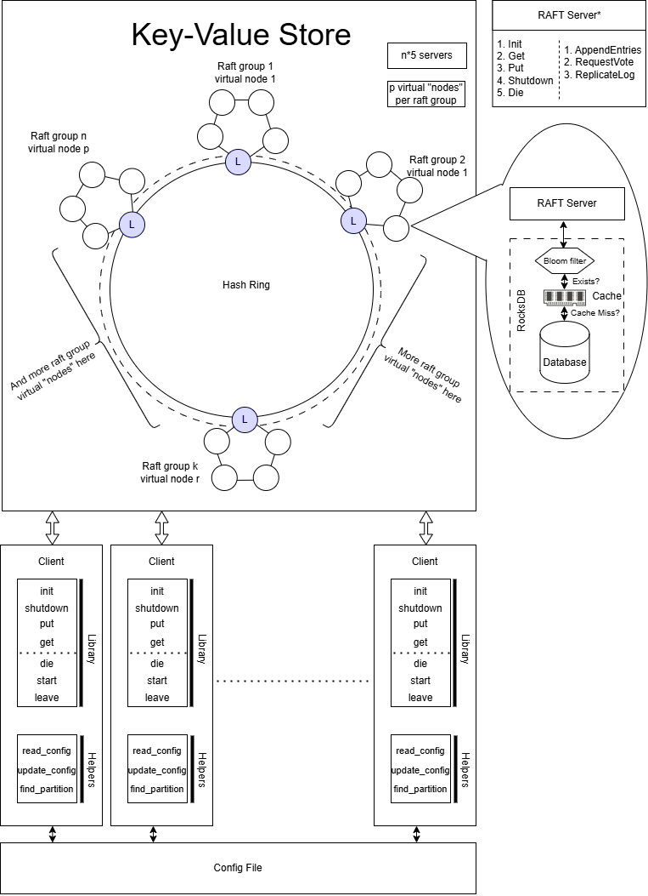

# Distributed Key-Value Store
<!-- Insert image from assets -->

<br>
This project is a Distributed Key-Value Store application that uses multi Raft groups to store key value in different partition. It RocksDB as the underlying Database and gPRC for server-client communication. Below are the steps to install the necessary dependencies and build the project.

## Prerequisites

Ensure you have the following installed on your system before building the project:

- **gRPC for C++**: Follow the tutorial on the official gRPC documentation [here](https://grpc.io/docs/languages/cpp/quickstart/).
    - Important: Place your project folder in the same root directory as the grpc folder, structured like this:
        ```
        |- grpc
        |- MyProjectFolder
        ```

- **RocksDB**: Install RocksDB and its development libraries using the following command:
        ```sh
        sudo apt install rocksDB librocksdb-dev
        ```

## Build Instructions

### Step 1: Clean Previous Build Files (Optional)
If you have previous build files, clean them by removing the cmake folder:
```sh
rm -rf cmake
```

### Step 2: Create and Navigate to Build Directory
Create a build directory within the project folder and make it the current working directory:
```sh
mkdir -p cmake/build
cd cmake/build
```

### Step 3: Run CMake
Run the following CMake command to configure the project. Replace `$MY_INSTALL_DIR` with the actual path where gRPC and other dependencies are installed:
```sh
cmake -DCMAKE_PREFIX_PATH=$MY_INSTALL_DIR ../..
```

### Step 4: Compile the Project
Run `make` to build the project. You can specify the number of parallel jobs (e.g., `-j 4` for 4 parallel jobs):
```sh
make -j 4
```

## Project Structure and Dependencies

### External Dependencies
The project relies on several external libraries, which are included and linked via the `CMakeLists.txt` and `common.cmake` files:
1. **gRPC**: The C++ gRPC library is used for client-server communication.
2. **Protobuf**: Protocol Buffers (protobuf) is used for serializing structured data.
3. **Abseil**: Abseil is a collection of C++ libraries.
4. **RocksDB**: RocksDB is used for database operations.

### CMake Configuration
1. The `CMakeLists.txt` file contains references to all the external libraries required by the project.
2. The `common.cmake` file is responsible for including gRPC, protobuf, and Abseil libraries.

### Linking External Libraries
Make sure that any external library is correctly linked in the `CMakeLists.txt` or `common.cmake` file if additional libraries are added in the future.

## Notes
- Ensure that your `$MY_INSTALL_DIR` variable points to the correct path where dependencies are installed (especially for gRPC).
- If encountering errors related to missing dependencies, ensure that all external libraries are installed and correctly linked.
